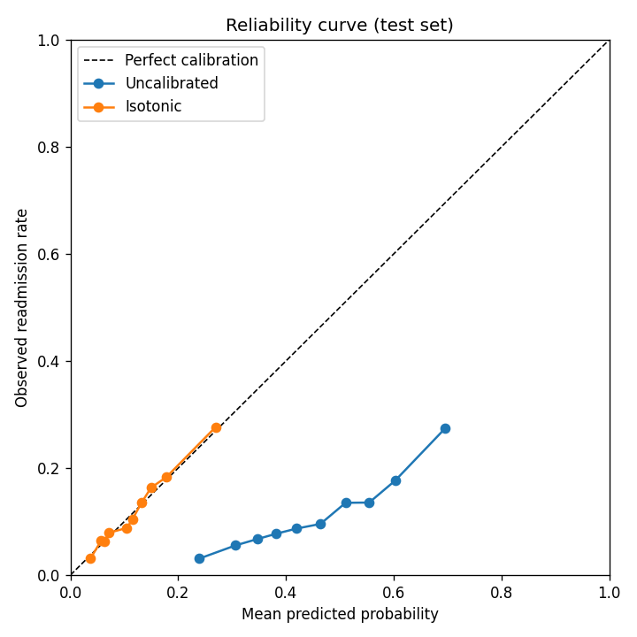

# Step 5 - Probability Calibration

## The bug
The model was trained with `class_weight="balanced"`, which up-weights
readmissions so the model focuses on them. AUC only measures ranking, so it
could not detect the side effect: every predicted probability is inflated.

## Test-set results (calibrators fitted on validation only)
| Method | ROC-AUC | Brier | ECE | Mean predicted | Actual rate |
|---|---|---|---|---|---|
| Uncalibrated | 0.679 | 0.2156 | 0.3386 | 45.2% | 11.3% |
| Platt (sigmoid) | 0.679 | 0.0957 | 0.0075 | 11.3% | 11.3% |
| Isotonic | 0.679 | 0.0957 | 0.0076 | 11.3% | 11.3% |

ECE = expected calibration error: average gap between predicted and
actual rates across 10 bins (lower is better; 0 = perfect).

## Per-tier check (test set)
Tier cutoffs were set on the validation set, then applied to test.

| Tier | Encounters | Raw predicted | Calibrated predicted | Actual |
|---|---|---|---|---|
| Very high | 1,032 | 73.6% | 31.0% | 31.2% |
| High | 2,799 | 62.0% | 18.5% | 19.5% |
| Medium | 5,988 | 51.2% | 12.6% | 12.4% |
| Low | 9,954 | 33.9% | 6.5% | 6.4% |

## Why isotonic
Isotonic regression is non-parametric (it only assumes higher score ->
higher risk), so it can fix any monotone distortion. Platt scaling assumes
a sigmoid shape. With ~20k validation rows there is enough data for
isotonic without overfitting.
