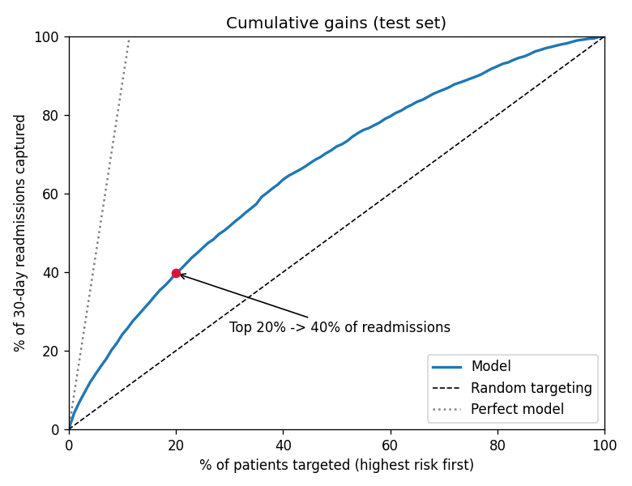
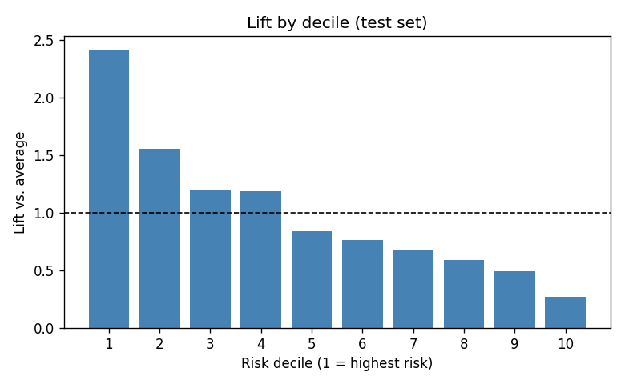

# Step 6 - Risk Tiering & Lift (test set)

Test set: 19,773 encounters, 2,244 readmissions (base rate 11.3%).

## Headline
Targeting the **top 20%** highest-risk patients reaches **39.7%** of all 30-day readmissions (95% bootstrap CI 37.8%-41.4%), vs. 20% for random targeting: **1.99x lift**.

## Risk tiers
Cutoffs set on validation data, applied to test.

| Tier | Patients | Share of patients | Readmissions | Share of readmissions | Predicted | Actual | Lift |
|---|---|---|---|---|---|---|---|
| Very high | 1,032 | 5.2% | 322 | 14.3% | 31.0% | 31.2% | 2.75x |
| High | 2,799 | 14.2% | 546 | 24.3% | 18.5% | 19.5% | 1.72x |
| Medium | 5,988 | 30.3% | 741 | 33.0% | 12.6% | 12.4% | 1.09x |
| Low | 9,954 | 50.3% | 635 | 28.3% | 6.5% | 6.4% | 0.56x |

Very high + High tiers together: 19.4% of patients, 38.7% of readmissions.

## Decile table
| Decile | Encounters | Readmissions | Predicted | Actual | Lift | Cumulative capture |
|---|---|---|---|---|---|---|
| 1 | 1,978 | 542 | 26.4% | 27.4% | 2.41x | 24.2% |
| 2 | 1,977 | 349 | 16.8% | 17.7% | 1.56x | 39.7% |
| 3 | 1,977 | 268 | 14.0% | 13.6% | 1.19x | 51.6% |
| 4 | 1,977 | 267 | 12.2% | 13.5% | 1.19x | 63.5% |
| 5 | 1,978 | 189 | 11.4% | 9.6% | 0.84x | 72.0% |
| 6 | 1,977 | 172 | 10.1% | 8.7% | 0.77x | 79.6% |
| 7 | 1,977 | 153 | 6.9% | 7.7% | 0.68x | 86.5% |
| 8 | 1,977 | 133 | 6.2% | 6.7% | 0.59x | 92.4% |
| 9 | 1,977 | 110 | 5.4% | 5.6% | 0.49x | 97.3% |
| 10 | 1,978 | 61 | 3.6% | 3.1% | 0.27x | 100.0% |

## Reading this honestly
- The model concentrates risk but does not isolate it: most readmissions
  still come from outside the top 20%. This is typical at AUC ~0.68.
- The top tier is where outreach is most efficient; lower tiers are better
  served by low-cost, population-wide measures.
