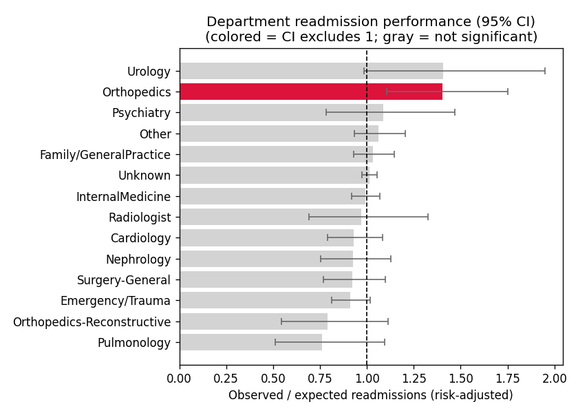
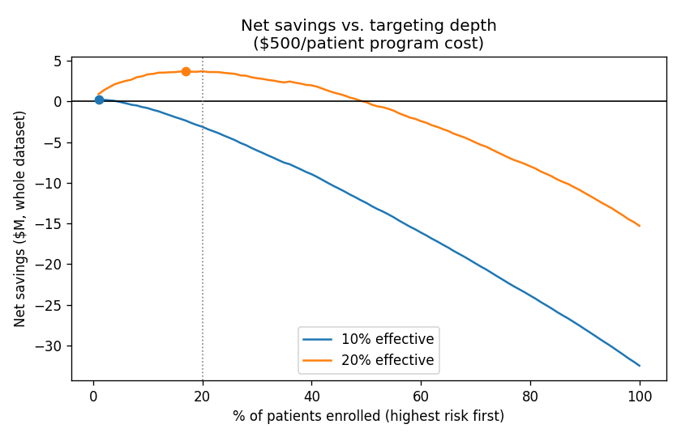

# Step 7 - Department Cost Analysis & Savings Simulation

## Assumptions
| Input | Value | Source |
|---|---|---|
| cost_per_readmission | $15,200 | AHRQ HCUP Statistical Brief #278 (2018): average cost of a 30-day all-cause adult readmission. A 2024 meta-analysis (Healthcare 12(7):750) estimates ~$16,000-16,900. |
| effectiveness_low | 10% | Conservative end. Leppin et al., JAMA Intern Med 2014 (42 RCTs): pooled RR 0.82, 95% CI 0.73-0.91. |
| effectiveness_high | 20% | Near the meta-analysis point estimate (18% reduction). |
| intervention_cost_per_patient | $500 | Transitional-care programs are reported at roughly $500-600 per patient. Weakest-sourced input; varies widely by program. |

## A. Department-level analysis
All 99,340 encounters; O/E uses out-of-sample (validation + test) predictions only. O/E > 1 means more readmissions than the patient mix predicts.

| Department | Encounters | Readmit rate | Avg LOS | Bed-days | Readmission cost | Per encounter | O/E (95% CI) | Flag |
|---|---|---|---|---|---|---|---|---|
| Unknown | 48,614 | 11.8% | 4.4 | 213,116 | $87.4M | $1,799 | 1.01 (0.97-1.06) |  |
| InternalMedicine | 14,237 | 11.5% | 4.6 | 65,111 | $25.0M | $1,753 | 0.99 (0.92-1.07) |  |
| Family/GeneralPractice | 7,252 | 12.1% | 4.4 | 31,559 | $13.4M | $1,842 | 1.03 (0.93-1.15) |  |
| Emergency/Trauma | 7,419 | 11.4% | 4.4 | 32,317 | $12.8M | $1,731 | 0.91 (0.81-1.02) |  |
| Other | 5,810 | 9.8% | 4.5 | 26,410 | $8.6M | $1,489 | 1.06 (0.93-1.21) |  |
| Cardiology | 5,278 | 8.0% | 3.5 | 18,498 | $6.4M | $1,221 | 0.93 (0.79-1.09) |  |
| Surgery-General | 3,059 | 11.2% | 4.5 | 13,850 | $5.2M | $1,699 | 0.92 (0.77-1.10) |  |
| Nephrology | 1,539 | 16.1% | 5.0 | 7,749 | $3.8M | $2,449 | 0.93 (0.75-1.13) |  |
| Orthopedics | 1,392 | 10.8% | 4.0 | 5,534 | $2.3M | $1,649 | 1.40 (1.11-1.75) | Worse than expected |
| Psychiatry | 853 | 12.2% | 6.4 | 5,457 | $1.6M | $1,853 | 1.09 (0.78-1.47) |  |
| Radiologist | 1,121 | 9.1% | 3.5 | 3,868 | $1.6M | $1,383 | 0.97 (0.69-1.33) |  |
| Pulmonology | 854 | 11.2% | 5.2 | 4,448 | $1.5M | $1,709 | 0.76 (0.51-1.10) |  |
| Orthopedics-Reconstructive | 1,230 | 7.5% | 3.9 | 4,804 | $1.4M | $1,137 | 0.79 (0.54-1.11) |  |
| Urology | 682 | 9.8% | 3.4 | 2,325 | $1.0M | $1,493 | 1.41 (0.99-1.95) |  |

Notes: 49% of encounters have no recorded specialty ("Unknown"). Raw readmission rates partly reflect patient mix; the O/E column adjusts for it. A department is flagged only when its whole 95% CI is above or below 1.

## B. Savings simulation
Population: 99,340 encounters, 11,314 readmissions. Targeting the Very high + High tiers enrolls 19.4% of patients and reaches 38.7% of readmissions (measured on the test set).

| | Low (10% effective) | High (20% effective) |
|---|---|---|
| Patients enrolled | 19,247 | 19,247 |
| Readmissions reached | 4,376 | 4,376 |
| Readmissions prevented | 438 | 875 |
| **Gross avoidable cost** | **$6.7M** | **$13.3M** |
| Program cost ($500/patient) | $9.6M | $9.6M |
| **Net savings** | **-$3.0M** | **$3.7M** |
| Break-even program cost per patient | $346 | $691 |

Time frame: the dataset spans 10 years across 130 hospitals, so these are totals over the whole dataset, roughly $0.7M-$1.3M gross per year across all 130 hospitals.

## Sensitivity: net savings (top tiers enrolled)
Rows = intervention effectiveness, columns = program cost per patient.

| Effectiveness | $250 | $500 | $750 | $1,000 |
|---|---|---|---|---|
| 10% | $1.8M | -$3.0M | -$7.8M | -$12.6M |
| 15% | $5.2M | $0.4M | -$4.5M | -$9.3M |
| 20% | $8.5M | $3.7M | -$1.1M | -$5.9M |
| 27% | $13.1M | $8.3M | $3.5M | -$1.3M |

## Best targeting depth ($500/patient)
| Scenario | Best % enrolled | Net savings |
|---|---|---|
| 10% effective | top 1% | $0.2M |
| 20% effective | top 17% | $3.7M |

## Interpretation
- Gross avoidable cost is large, but whether the program pays for itself
  depends mostly on its cost per patient and how well it works.
- Enrolling fewer, higher-risk patients is more cost-efficient: the model's
  value is in deciding who to enroll, not in enrolling more people.
- The simulation assumes the intervention works equally well in every tier;
  real programs should be piloted and measured.
